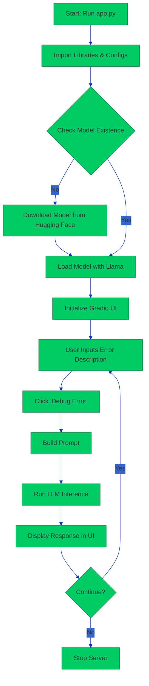
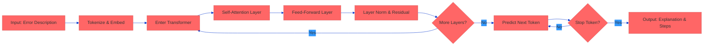

# Python Error Debugger AI APPlication 
## Surya Prakash Karasala
*Date: September 16, 2025*

## Table of Contents
- [Introduction](#introduction)
- [How the Code Works](#how-the-code-works)
  - [Code Structure](#code-structure)
  - [Execution Flow Diagram](#execution-flow-diagram)
- [Setup and Run Instructions](#setup-and-run-instructions)
  - [Step 1: Environment Setup](#step-1-environment-setup)
  - [Step 2: Prepare Code](#step-2-prepare-code)
  - [Step 3: Run the Application](#step-3-run-the-application)
  - [Step 4: Push to GitHub](#step-4-push-to-github)
- [Resolving Low Disk Space Issues](#resolving-low-disk-space-issues)
- [Model Architecture](#model-architecture)
  - [How the Model Works](#how-the-model-works)
  - [Architecture Details](#architecture-details)
  - [Model Workflow Diagram](#model-workflow-diagram)
- [Pros and Cons](#pros-and-cons)
- [Conclusion](#conclusion)

## Introduction
This document provides a detailed explanation of a Python error debugging tool implemented in `app.py`, using the Qwen2.5-0.5B-Instruct-GGUF model and a Gradio interface. It covers the code's functionality, setup instructions, model architecture, pros and cons, low disk space troubleshooting, and advanced colored diagrams for execution and model workflows.

## How the Code Works
The `app.py` script implements a web-based tool that uses a quantized language model to debug Python errors based on user-provided error descriptions. Below is a breakdown of its functionality.

### Code Structure
- **Imports and Configuration**:
  - **Libraries**:
    - `gradio`: Builds the web interface.
    - `llama_cpp`: Runs the GGUF model on CPU.
    - `huggingface_hub`: Downloads the model from Hugging Face.
    - `os`: Manages file paths.
  - **Configuration**: Specifies model (`Qwen/Qwen2.5-0.5B-Instruct-GGUF`), quantized file (`qwen2.5-0.5b-instruct-q4_k_m.gguf`), and cache directory (`~/.cache/huggingface/hub`).
- **Model Download (`download_model`)**:
  - Checks for model in cache; downloads if absent (~300MB) using `hf_hub_download`.
  - Returns model path.
- **Model Loading**:
  - Initializes `Llama` with:
    - Context size: 2048 tokens.
    - Threads: 4 (CPU cores).
    - GPU layers: 0 (CPU-only).
- **Debugging Function (`debug_python_error`)**:
  - Takes error description as input.
  - Builds a structured prompt for the model to explain and fix the error.
  - Runs inference with low temperature (0.1) for accuracy.
  - Returns formatted response.
- **Gradio Interface**:
  - Creates UI with textbox, markdown output, and submit button.
  - Launches server on `0.0.0.0:7860`.

### Execution Flow Diagram
The following Mermaid diagram illustrates the code execution flow. Copy this code to [mermaid.live](https://mermaid.live), select the "Base" theme with custom colors, and export as a colored PNG for PDF inclusion.



*Placeholder: Insert PNG of above Mermaid diagram here after rendering.*

## Setup and Run Instructions
Follow these steps to set up and run the project on a Linux-based system (e.g., Ubuntu, GitHub Codespaces). Adjust for Windows/Mac as needed.

### Step 1: Environment Setup
1. **Install Python 3.8+**:
   Verify with:
   ```bash
   python3 --version
   ```
   Install if needed (Ubuntu):
   ```bash
   sudo apt update && sudo apt install python3 python3-pip python3-venv
   ```
2. **Create Project Directory**:
   ```bash
   mkdir python-error-debugger && cd python-error-debugger
   ```
3. **Create Virtual Environment**:
   ```bash
   python3 -m venv venv
   source venv/bin/activate
   ```
4. **Create `requirements.txt`**:
   ```text
   llama-cpp-python==0.2.78
   gradio==4.44.0
   huggingface-hub==0.24.6
   torch==2.4.1
   numpy==1.26.4
   ```
5. **Install Dependencies**:
   ```bash
   pip install -r requirements.txt
   ```

### Step 2: Prepare Code
1. Save the provided `app.py` in the project directory.
2. **Pre-download Model** (optional):
   ```bash
   python3 -c "from huggingface_hub import hf_hub_download; hf_hub_download(repo_id='Qwen/Qwen2.5-0.5B-Instruct-GGUF', filename='qwen2.5-0.5b-instruct-q4_k_m.gguf')"
   ```

### Step 3: Run the Application
1. **Start the App**:
   ```bash
   python3 app.py
   ```
   Access at `http://localhost:7860` (or Codespaces forwarded port).
2. **Test**: Enter an error (e.g., `KeyError: 'user_id'`), submit, and verify output.
3. **Stop**: Press `Ctrl+C`.

### Step 4: Push to GitHub
1. **Initialize Git**:
   ```bash
   git init
   ```
2. **Create `.gitignore`**:
   ```text
   venv/
   __pycache__/
   *.pyc
   *.gguf
   .cache/
   ```
3. **Commit Files**:
   ```bash
   git add app.py requirements.txt .gitignore
   git commit -m "Initial commit: Python Error Debugger"
   ```
4. **Push to GitHub**:
   Create a repo on [GitHub](https://github.com), then:
   ```bash
   git remote add origin https://github.com/yourusername/python-error-debugger.git
   git branch -M main
   git push -u origin main
   ```

## Resolving Low Disk Space Issues
Low disk space can prevent model download or execution. Here are steps to resolve it:

1. **Check Disk Space**:
   ```bash
   df -h
   ```
   Look for the root filesystem (`/`) or relevant mount point.
2. **Clear Cache**:
   - Remove Hugging Face cache:
     ```bash
     rm -rf ~/.cache/huggingface/*
     ```
   - Clear pip cache:
     ```bash
     pip cache purge
     ```
3. **Remove Unnecessary Files**:
   - Find large files:
     ```bash
     find / -type f -size +100M
     ```
   - Delete unneeded files (e.g., logs, temp files) with caution:
     ```bash
     rm -rf /path/to/large/file
     ```
4. **Extend Disk Space** (if possible):
   - In Codespaces: Upgrade to a larger instance via GitHub settings.
   - On local/cloud: Add storage or resize partition (e.g., `resize2fs` for ext4).
5. **Re-run Model Download**: Retry `python3 app.py` after freeing space.

## Model Architecture
The Qwen2.5-0.5B-Instruct-GGUF is a small, instruction-tuned transformer model optimized for efficiency.

### How the Model Works
- **Input**: Tokenizes error description into embeddings.
- **Transformer**: Processes via decoder layers with self-attention and feed-forward networks.
- **Output**: Generates text autoregressively, producing explanations and steps.
- **Quantization**: Uses q4_k_m (4-bit) for CPU efficiency.

### Architecture Details
- **Type**: Decoder-only transformer.
- **Parameters**: 0.5 billion.
- **Layers**: ~24–28 (scaled from Qwen2.5-72B's 80 layers).
- **Hidden Size**: ~2048.
- **Attention**: Multi-head with RoPE (up to 128K tokens).
- **Feed-Forward**: SwiGLU activation.
- **Vocab**: ~150K tokens, 29 languages.

### Model Workflow Diagram
Render the following Mermaid code for a colored diagram:



*Placeholder: Insert PNG of above Mermaid diagram here after rendering.*

## Pros and Cons
- **Pros**:
  - **Efficient**: ~300MB, runs on CPU with ~1–2GB RAM.
  - **Multilingual**: Supports 29 languages.
  - **Cost-Effective**: Ideal for local/edge devices.
  - **Strong for Coding**: Good for error debugging.
- **Cons**:
  - **Limited Reasoning**: Smaller size limits complex error handling.
  - **Hallucinations**: May give inaccurate fixes for ambiguous inputs.
  - **Context Limit**: 2048 tokens in code (though model supports 128K).
  - **Quantization Trade-offs**: Slight accuracy loss for speed.

## Conclusion
This tool provides an efficient, accessible way to debug Python errors using a lightweight model. The provided diagrams, setup steps, and troubleshooting ensure smooth deployment.
